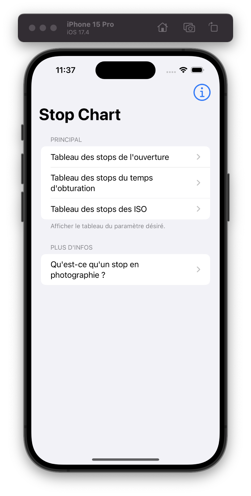
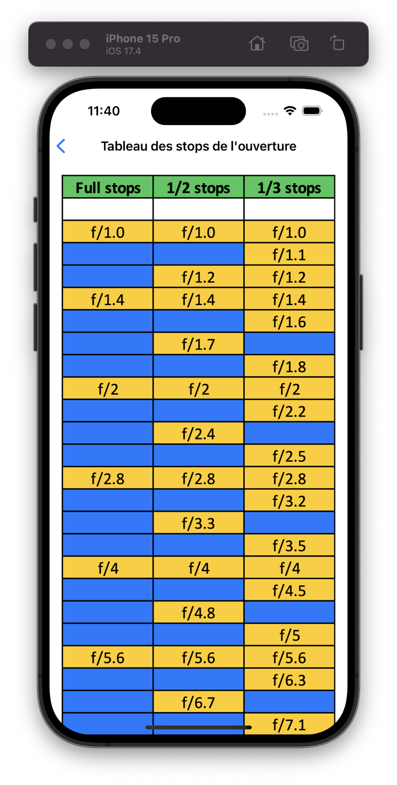
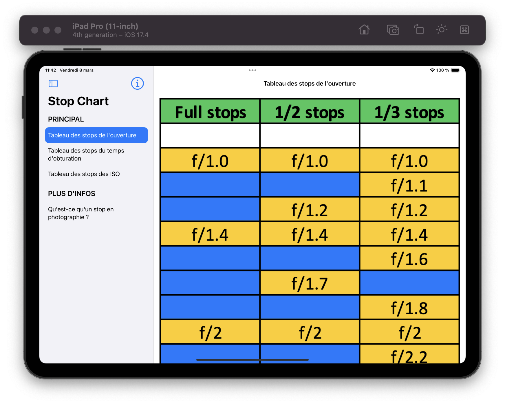
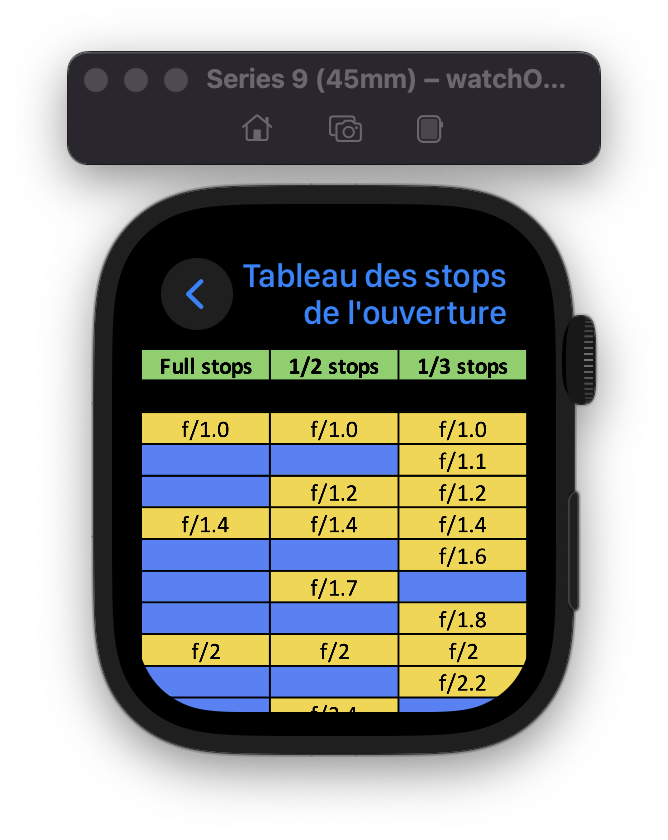

# Stop-Chart

Stop Chart is an innovative app designed for photographers, providing easy access to the essential "stop charts" for photography parameters. This tool is crafted to help photographers make informed decisions about exposure, aperture, and ISO settings, enhancing the quality of their work. Developed with SwiftUI, Stop Chart offers a sleek and intuitive interface, ensuring a seamless user experience across various Apple devices.

## Overview

Stop Chart is built to empower photographers by offering quick insights into three critical "stop charts" directly from their iOS, iPadOS, macOS, or watchOS devices. Whether you're a professional photographer or a passionate enthusiast, Stop Chart provides the information you need to capture the perfect shot under any conditions.

**Languages Supported:** Stop Chart is available in both English 🇬🇧 and French 🇫🇷, making it accessible to a wider audience of photographers around the globe.

## Features

- **Comprehensive Stop Charts**: Access detailed charts for exposure, aperture, and ISO settings.
- **Cross-Platform Compatibility**: Designed for iPhone, iPad, Mac, and Apple Watch. Compatible with iOS 14.0 and watchOS 7.0 or newer.
- **Intuitive Design**: Built with SwiftUI for a seamless user experience.
- **Legacy Support**: A separate branch with support for iOS 13 and watchOS 6.
- **Multilingual Support**: Available in English and French.
- **Independent Apple Watch App**: The app on Apple Watch supports running without the need for the iOS app installation, offering flexibility and convenience.

## Screenshots

### iPhone
<p align="center">
    
    
</p>

### iPad


### Mac


### Apple Watch
<p align="center">
    
    
</p>

## Installation

Stop Chart requires at least iOS 14.0 and watchOS 7.0 to run.

As Stop Chart is no longer available on the App Store, you'll need to manually install it by cloning the repository and setting it up in Xcode.

1. Clone the repository:

```bash
git clone https://github.com/LukasMFR/Stop-Chart.git
```

2. Open the project in Xcode.
3. Before running the app, you need to change the team to your own Apple Developer account. Go to the project settings, select the 'Signing & Capabilities' tab, and choose your team from the dropdown menu.
4. Build and run the app on your device.

## Usage

After installing Stop Chart, you can easily navigate through the different stop charts available for exposure, aperture, and ISO settings. Select the parameter you wish to explore, and Stop Chart will display the corresponding chart, aiding in making precise adjustments to your camera settings.

## Contributing

We welcome contributions to Stop Chart! Whether it's reporting a bug, proposing a feature, or submitting a pull request, your input helps us make Stop Chart better for photographers everywhere.

To contribute:

1. Fork the repository.
2. Create your feature branch (`git checkout -b feature/AmazingFeature`).
3. Commit your changes (`git commit -am 'Add some AmazingFeature'`).
4. Push to the branch (`git push origin feature/AmazingFeature`).
5. Open a pull request.

### Note

There is a branch called [legacy-ios13](https://github.com/LukasMFR/Stop-Chart/tree/legacy-ios13) for users who require support for iOS 13 and watchOS 6. This branch contains the original code from 2019 and is maintained for legacy device compatibility.

---

We hope Stop Chart enhances your photography experience, and we look forward to your contributions and feedback.
