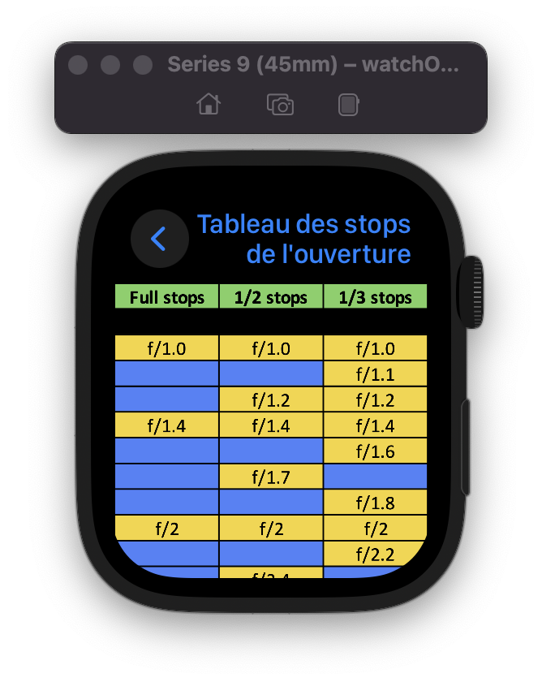

# Stop-Chart (Legacy iOS 13 Support)

This version of Stop Chart is a special edition designed for photographers using older Apple devices, offering support for iOS 13 and watchOS 6. It provides easy access to the essential "stop charts" for photography parameters, helping photographers make informed decisions about exposure, aperture, and ISO settings. While developed initially with earlier versions of SwiftUI, this legacy version maintains a user-friendly interface, tailored to work seamlessly on devices not supporting iOS 14.0 and watchOS 7.0 or newer.

## Overview

The legacy version of Stop Chart continues to empower photographers by providing quick insights into three critical "stop charts" from their older iOS and watchOS devices. It retains its valuable features and functionality, ensuring that even users with devices running iOS 13 or watchOS 6 can capture the perfect shot under any conditions.

**Languages Supported:** Stop Chart is available in both English 🇬🇧 and French 🇫🇷, making it accessible to a wider audience of photographers around the globe.

## Code Originality and Dependencies

This legacy version of Stop Chart strives to remain as true to the original codebase as possible, mirroring the version available on the App Store in 2019/2020. It represents the app in its original form, ensuring that users and developers experience the application as it was initially designed, with minimal alterations. However, please note that this codebase lacks the CocoaPods dependencies, such as the Podfile, that were used for integrating Google Ads into the application. This exclusion is intended to simplify the setup process and reduce the potential for third-party issues, focusing on the core functionality of Stop Chart.

## Features

- **Comprehensive Stop Charts**: Access detailed charts for exposure, aperture, and ISO settings.
- **Cross-Platform Compatibility**: Designed for iPhone, iPad, Mac, and Apple Watch. Compatible with iOS 13.0 and watchOS 6.0 or newer.
- **Intuitive Design**: Although developed with an earlier version of SwiftUI, it provides a seamless user experience.
- **Multilingual Support**: Available in English and French.
- **Independent Apple Watch App**: The app on Apple Watch supports running without the need for the iOS app installation, offering flexibility and convenience.

## Screenshots

### iPhone
<p align="center">
    
    
</p>

### iPad


### Mac


### Apple Watch
<p align="center">
    
    
</p>

## Installation

This legacy version of Stop Chart requires iOS 13.0 and watchOS 6.0, but it has been tested and confirmed to still work on devices running up to iOS 17 and watchOS 10 as of the writing of this README. This ensures that even users with the latest Apple devices can enjoy the classic Stop Chart experience.

1. Clone the repository:

```bash
git clone -b legacy-ios13 https://github.com/LukasMFR/Stop-Chart.git
```

2. Open the project in Xcode compatible with iOS 13 and watchOS 6 development.
3. Change the team to your own Apple Developer account in the project settings under 'Signing & Capabilities'.
4. Build and run the app on your device.

## Usage

Users can navigate through the stop charts for exposure, aperture, and ISO settings just like in the main version. This ensures that the functionality remains consistent for users of older devices.

## Contributing

Contributions to the legacy version are welcome! Whether it's reporting a bug specific to the older versions, proposing features feasible within the legacy framework, or submitting a pull request, your input is invaluable.

To contribute:

1. Fork the repository.
2. Switch to the legacy-ios13 branch (`git checkout legacy-ios13`).
3. Create your feature branch off the legacy branch (`git checkout -b feature/LegacyAmazingFeature`).
4. Commit your changes and push to the branch.
5. Open a pull request against the legacy-ios13 branch.

---

We appreciate your support for Stop Chart and hope this legacy version enhances your photography experience on older devices.
